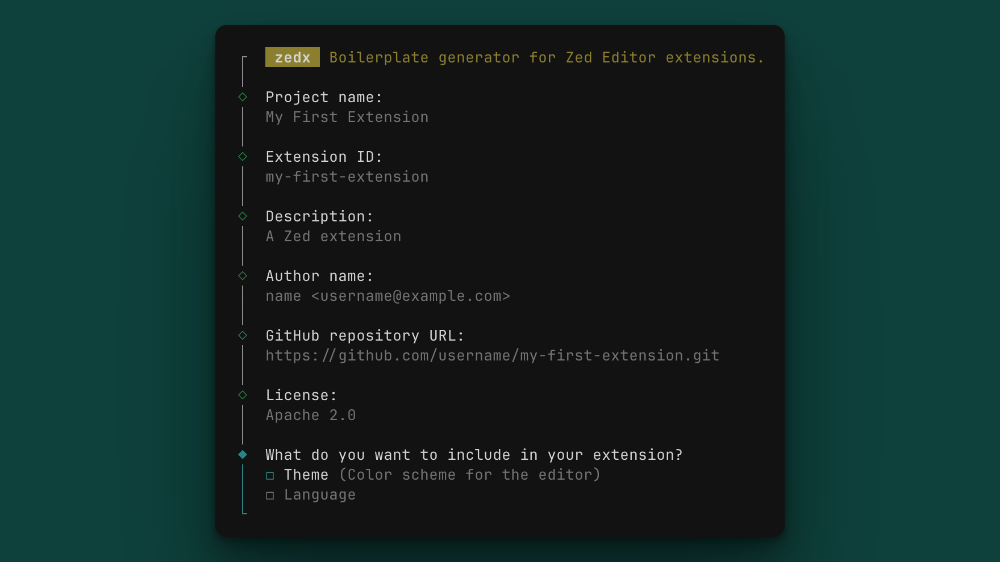

# zedx

Boilerplate generator for [Zed Editor](https://zed.dev/) extensions.



## Installation

```bash
npm install -g zedx

# or
brew install tahayvr/tap/zedx
```

### Usage

```bash
# Create a new extension
zedx

# Bump extension version
# Run inside extension dir
zedx version patch   # 1.2.3 → 1.2.4
zedx version minor   # 1.2.3 → 1.3.0
zedx version major   # 1.2.3 → 2.0.0
```

### Supported extension types:

1. **Themes** - Color schemes for the editor
2. **Languages** - Syntax highlighting, indentation, and optional LSP support

You can choose to include theme, language, or both when creating an extension.
