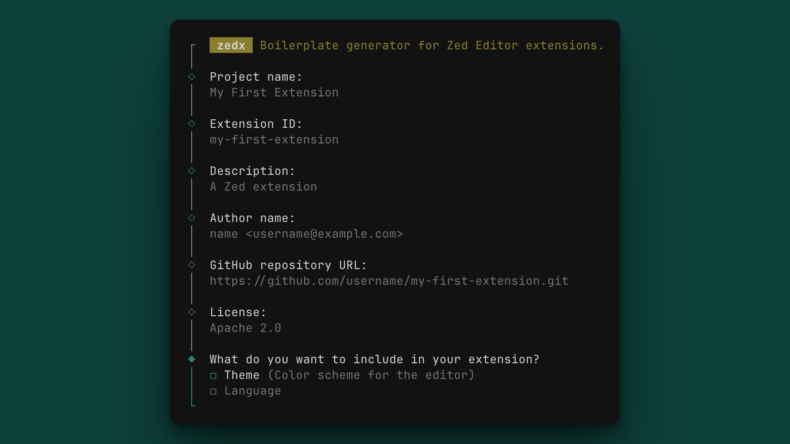

<div align="center">


CLI toolkit for Scaffolding [Zed Editor](https://zed.dev/) extensions and syncing settings across machines.

</div>



## Installation

```bash
npm install -g zedx

# or
brew install tahayvr/tap/zedx
```

## Usage

### Scaffolding an extension

```bash
# Create a new extension
zedx create

# Add a theme or language to an existing extension
zedx add theme "Midnight Blue"
zedx add language rust
```

### Supported extension types:

1. **Themes** - Color schemes for the editor
2. **Languages** - Syntax highlighting, indentation, and optional LSP support

You can choose to include theme, language, or both when creating an extension.

### Validation

```bash
# Validate extension config and show what is missing or incomplete
zedx check
```

### Sync

Sync your Zed config across machines using a private Git repo as the source of truth.

**1. Link a repo (one-time setup)**

```bash
zedx sync init
```

Prompts for a Git repo URL (SSH or HTTPS) and a branch name (defaults to `main`). The repo is saved to `~/.config/zedx/config.json`. No files are synced yet.

> [!NOTE]
> `settings.json` and `keymap.json` are tracked. Extension sync is handled via the `auto_install_extensions` field within `settings.json`, which Zed uses to automatically download and install extensions.

**2. Run a sync**

```bash
zedx sync            # Sync local ↔ remote, prompts when both sides changed
zedx sync --local    # Always keep local on conflict (no prompt)
zedx sync --remote   # Always use remote on conflict (no prompt)
```

**3. Check sync state**

```bash
zedx sync status
```

**4. Auto-sync with an OS daemon**

```bash
zedx sync install    # Install and enable the daemon
zedx sync uninstall  # Disable and remove the daemon
```

Installs a file-watcher that triggers `zedx sync` automatically whenever config files are saved. Supported platforms:

| Platform | Mechanism                                              | Logs                                     |
| -------- | ------------------------------------------------------ | ---------------------------------------- |
| macOS    | launchd (`~/Library/LaunchAgents/dev.zedx.sync.plist`) | `~/Library/Logs/zedx-sync.log`           |
| Linux    | systemd user units (`~/.config/systemd/user/`)         | `journalctl --user -u zedx-sync.service` |

The daemon enforces a 30-second throttle on macOS to avoid rapid re-triggers. When a conflict is detected in daemon mode (no TTY), local always wins and a warning is logged.

### Versioning

Bump the extension version:

```bash
zedx version patch   # 1.2.3 → 1.2.4
zedx version minor   # 1.2.3 → 1.3.0
zedx version major   # 1.2.3 → 2.0.0
```

### License

License is Apache-2.0. See [LICENSE](./LICENSE) for details.
