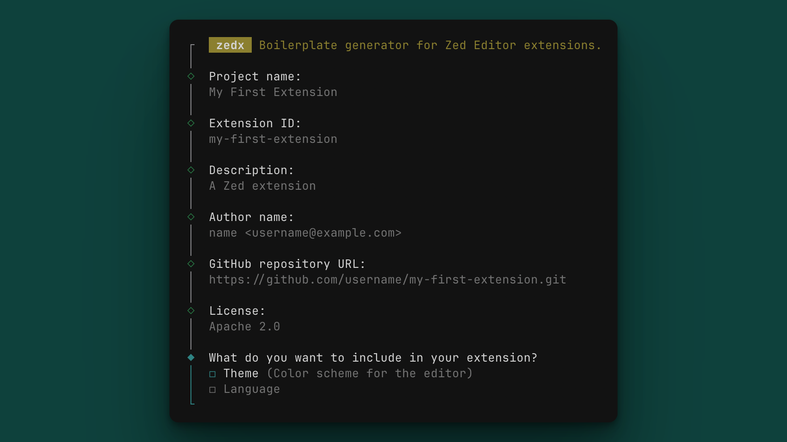

<p align="center">

</p>

<p align="center"> CLI toolkit for the Zed Editor</p>



## Installation

```bash
npm install -g zedx

# or
brew install tahayvr/tap/zedx
```

## Usage

### Sync

Sync your Zed config across machines using a private Git repo as the source of truth.

**1. Link a repo (one-time setup)**

```bash
zedx sync init
```

Prompts for a Git repo URL (SSH or HTTPS) and a branch name (defaults to `main`). The repo is saved to `~/.config/zedx/config.json`. No files are synced yet.

> [!NOTE]
> `settings.json`, `keymap.json`, `tasks.json`, and `snippets/*.json` are tracked. Extension sync is handled via the `auto_install_extensions` field within `settings.json`, which Zed uses to automatically download and install extensions.

**2. Run a sync**

```bash
zedx sync            # Sync local ↔ remote, prompts when both sides changed
zedx sync --local    # Always keep local on conflict (no prompt)
zedx sync --remote   # Always use remote on conflict (no prompt)
```

**3. Check sync state**

```bash
zedx sync status
```

**4. Auto-sync with an OS daemon**

```bash
zedx sync install    # Install and enable the daemon
zedx sync uninstall  # Disable and remove the daemon
```

Installs a background job that triggers `zedx sync` automatically. Supported platforms:

| Platform | Mechanism                                              | Trigger                | Logs                                                           |
| -------- | ------------------------------------------------------ | ---------------------- | -------------------------------------------------------------- |
| macOS    | launchd (`~/Library/LaunchAgents/dev.zedx.sync.plist`) | instantly on file save | `~/Library/Logs/zedx/sync.log`                                 |
| Linux    | systemd user units (`~/.config/systemd/user/`)         | instantly on file save | `journalctl --user -u zedx-sync.service`                       |
| Windows  | Task Scheduler (`ZedxSync` task)                       | polls every 5 minutes  | Task Scheduler → Task Scheduler Library → `ZedxSync` → History |

Windows has no lightweight per-file watch hook for Task Scheduler (unlike launchd's `WatchPaths` or systemd's `PathChanged`), so it polls on an interval instead of syncing instantly on save.

The daemon enforces a 30-second throttle on macOS to avoid rapid re-triggers. Any unattended run (no TTY attached — daemon, scheduled task, CI, etc.) automatically resolves conflicts by keeping local and logging a warning, instead of prompting.

### Scaffolding an extension

```bash
# Create a new extension
zedx create

# Add a theme, icon theme, or language to an existing extension
zedx add theme "Midnight Blue"
zedx add icon-theme "Midnight Blue Icons"
zedx add language rust
```

### Supported extension types:

1. **Themes** - Color schemes for the editor
2. **Icon themes** - File/folder icons in the project panel
3. **Languages** - Syntax highlighting, indentation, and optional LSP support

You can choose any combination of these when creating an extension.

### Validation

```bash
# Validate extension config and show what is missing or incomplete
zedx check
```

### Configuration

```bash
zedx config                      # Open interactive config menu
zedx config repo                  # Change your sync repo and branch directly
zedx config conflict              # Set default conflict strategy interactively
zedx config conflict --ask        # Always prompt on conflict
zedx config conflict --local      # Local always wins, no prompt
zedx config conflict --remote     # Remote always wins, no prompt
zedx config files                 # Choose which files zedx sync touches by default
```

`zedx sync select` still exists for one-off overrides — `zedx config files` sets the persistent default so every plain `zedx sync` only touches the files you chose.

### Versioning

Bump the extension version:

```bash
zedx version patch   # 1.2.3 → 1.2.4
zedx version minor   # 1.2.3 → 1.3.0
zedx version major   # 1.2.3 → 2.0.0
```

### License

License is Apache-2.0. See [LICENSE](./LICENSE) for details.
